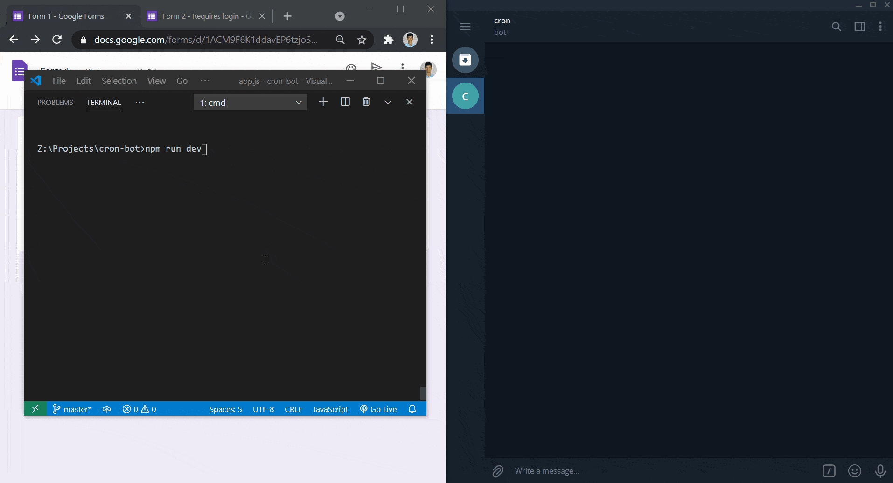

## cron-bot
An automation bot to monitor and fill forms

### Screenshots

  

### Features
1. Monitor forms and notifies when they are opened.
2. Most of the required info is already stored and provides options for easy input when required.
3. Once the form is filled, captures and sends a screenshot for verification. 
4. If the form requires login, then a **pre-filled** form link will be sent so that existing cookies from the user's default browser can be used.  
5. Plots a bar graph from monitor data so that users can know form status conveniently.
6. Usually all monitoring takes place according to `Time table` but if needed a new job can be scheduled via a command
7. User can see all running jobs via a command
8. The bot is best utilized when the Telegram client is installed on both the phone and PC so that the user never misses an update.

### Implementation
 - A `master scheduler` is invoked every morning from Monday through Saturday.
 - The master scheduler fires up `form monitor` jobs of that day according to time table
 - Form monitor checks the form every minute until the form is opened or up to a predetermined end time.
 - if the form is already open then that job is terminated and the user is notified.
 - The monitor data is stored in memory, and the graph is plotted from that when required.
 - The DOM is generated from the HTML response and the screenshot is sent. 
 - The bot is hosted to make the best of it.
 - Currently, the bot supports only a single user, it can be modified to support multiple users by introducing a database.
 
> _"Modern problems require modern solutions"_